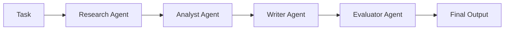
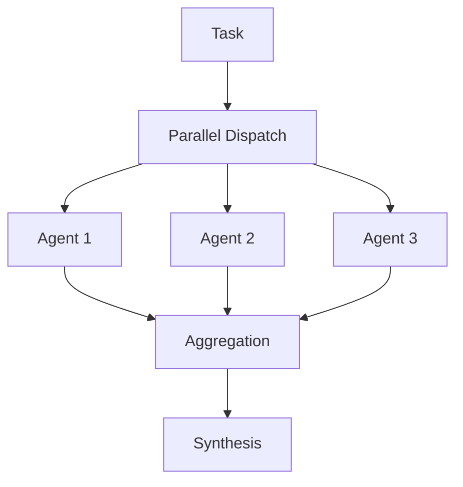
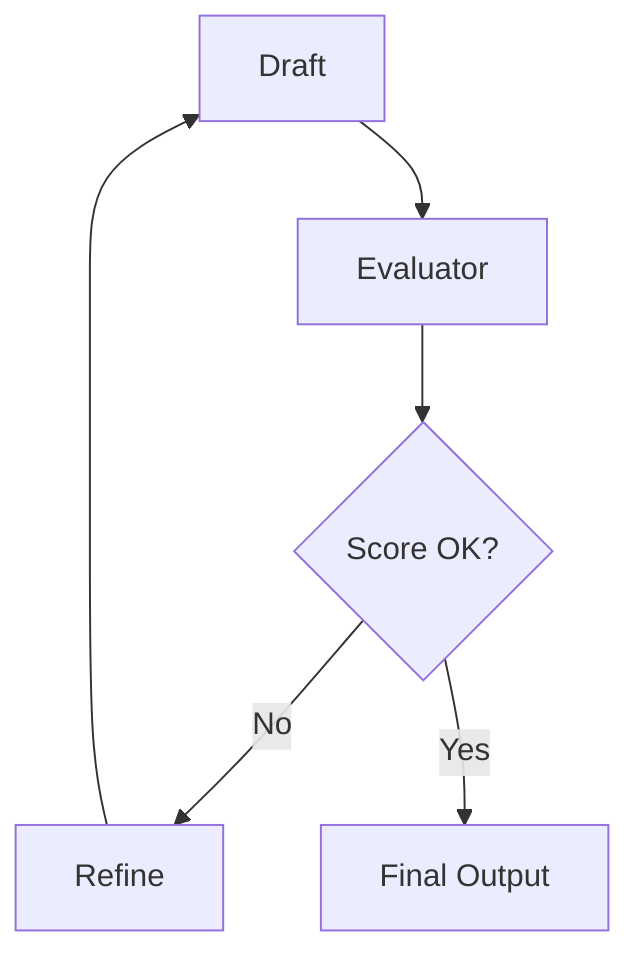

# Orchestrator Agent

## Purpose

The Orchestrator Agent manages complex workflows by delegating tasks to specialized agents, coordinating their outputs, and ensuring coherent end-to-end execution. It serves as the primary interface for multi-agent operations.

## Agent Definition

```typescript
import { ToolLoopAgent } from "ai";
import { anthropic } from "@ai-sdk/anthropic";
import { orchestrationTools } from "../tools";

export const orchestratorAgent = new ToolLoopAgent({
  name: "orchestrator",
  model: anthropic("claude-sonnet-4-20250514"),
  instructions: `You are a workflow orchestration expert.

Your role is to:
1. Analyze complex tasks and break them into subtasks
2. Assign subtasks to appropriate specialized agents
3. Coordinate agent outputs and handle dependencies
4. Synthesize results into coherent final outputs
5. Handle errors and retries gracefully

Orchestration Principles:
- Decompose tasks by capability requirements
- Parallelize independent operations when possible
- Maintain context continuity across agent handoffs
- Validate intermediate outputs before proceeding
- Provide clear status updates during long operations

Available Agents:
- evaluator: Assesses quality of LLM outputs
- researcher: Gathers and synthesizes information
- writer: Generates and refines content
- analyst: Performs data analysis and insights

When delegating:
- Provide complete context the agent needs
- Specify expected output format
- Set clear success criteria`,
  
  tools: {
    delegateToAgent: orchestrationTools.delegateToAgent,
    parallelExecution: orchestrationTools.parallelExecution,
    waitForCompletion: orchestrationTools.waitForCompletion,
    synthesizeResults: orchestrationTools.synthesizeResults,
    handleError: orchestrationTools.handleError
  }
});
```

## Capabilities

### Task Delegation
Route a task to a specialized agent.

**Input:**
- Agent name
- Task description
- Context/dependencies
- Expected output format

**Output:**
- Agent response
- Execution metadata
- Status

### Parallel Execution
Execute multiple independent tasks simultaneously.

**Input:**
- List of (agent, task) pairs
- Timeout configuration

**Output:**
- Results array
- Completion status per task
- Any errors encountered

### Result Synthesis
Combine outputs from multiple agents into coherent result.

**Input:**
- Agent outputs
- Synthesis instructions
- Target format

**Output:**
- Synthesized result
- Source attribution
- Confidence assessment

### Error Handling
Manage failures and implement retry logic.

**Input:**
- Failed task
- Error details
- Retry policy

**Output:**
- Retry result or
- Graceful degradation or
- Error escalation

## Configuration

```typescript
interface OrchestratorConfig {
  // Execution settings
  maxParallelTasks: number;
  defaultTimeout: number; // ms
  retryPolicy: RetryPolicy;
  
  // Quality settings
  validateIntermediateOutputs: boolean;
  evaluateBeforeDelivery: boolean;
  
  // Reporting
  enableProgressUpdates: boolean;
  updateFrequency: number; // ms
}

interface RetryPolicy {
  maxRetries: number;
  backoffMultiplier: number;
  retryableErrors: string[];
}

const defaultConfig: OrchestratorConfig = {
  maxParallelTasks: 5,
  defaultTimeout: 60000,
  retryPolicy: {
    maxRetries: 3,
    backoffMultiplier: 2,
    retryableErrors: ["RATE_LIMIT", "TIMEOUT", "TEMPORARY_ERROR"]
  },
  validateIntermediateOutputs: true,
  evaluateBeforeDelivery: false,
  enableProgressUpdates: true,
  updateFrequency: 5000
};
```

## Usage Example

```typescript
import { orchestratorAgent } from "./agents/orchestrator-agent";

const result = await orchestratorAgent.generate({
  prompt: `Complete the following research and analysis task:

1. Research current best practices for LLM evaluation
2. Analyze the trade-offs between different evaluation methods
3. Generate a recommendation report
4. Evaluate the quality of the report

Ensure the final output is comprehensive but accessible to technical leaders.`
});
```

## Orchestration Patterns

### Sequential Pipeline


### Parallel with Aggregation


### Iterative Refinement


## Integration Points

- **API Gateway**: Primary entry point for complex requests
- **Job Queue**: Handle long-running orchestrated tasks
- **Monitoring**: Track multi-agent execution metrics
- **Audit Log**: Record all delegations and decisions

