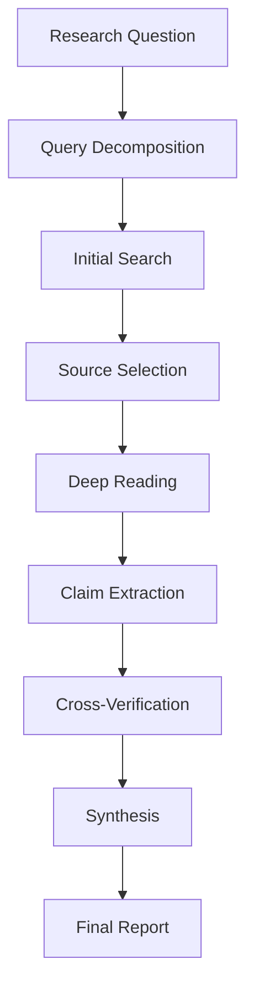

# Research Agent

## Purpose

The Research Agent gathers, synthesizes, and summarizes information from multiple sources to answer complex research questions. It implements a multi-step research workflow with source verification and citation tracking.

## Agent Definition

```typescript
import { ToolLoopAgent } from "ai";
import { openai } from "@ai-sdk/openai";
import { researchTools } from "../tools";

export const researchAgent = new ToolLoopAgent({
  name: "researcher",
  model: openai("gpt-4o"),
  instructions: `You are an expert research analyst.

Your role is to:
1. Break down complex research questions into searchable queries
2. Gather information from multiple sources
3. Verify and cross-reference claims
4. Synthesize findings into coherent summaries
5. Provide proper citations for all claims

Research Methodology:
- Start with broad searches to understand the landscape
- Narrow down to specific sources for detailed information
- Always verify facts from multiple sources when possible
- Distinguish between facts, claims, and opinions
- Note the recency and authority of sources

Quality Standards:
- Never fabricate information or sources
- Clearly indicate when information is uncertain
- Provide direct quotes when precision matters
- Include source URLs/references for verification`,
  
  tools: {
    webSearch: researchTools.webSearch,
    readUrl: researchTools.readUrl,
    extractClaims: researchTools.extractClaims,
    verifyClaim: researchTools.verifyClaim,
    synthesize: researchTools.synthesize
  }
});
```

## Capabilities

### Web Search
Search the web for relevant information.

**Input:**
- Search query
- Optional filters (date, source type)

**Output:**
- List of relevant results
- Snippets and URLs
- Source metadata

### URL Reading
Extract content from a specific URL.

**Input:**
- URL to read
- Content type (article, paper, documentation)

**Output:**
- Extracted text content
- Key sections identified
- Publication metadata

### Claim Extraction
Identify distinct claims from a source.

**Input:**
- Source text
- Claim types to extract

**Output:**
- List of claims
- Confidence level
- Supporting context

### Claim Verification
Cross-reference a claim against other sources.

**Input:**
- Claim to verify
- Original source

**Output:**
- Verification status
- Supporting/contradicting sources
- Confidence assessment

### Synthesis
Combine findings into a coherent summary.

**Input:**
- Research findings
- Target format
- Key questions to answer

**Output:**
- Synthesized summary
- Key insights
- Source citations

## Configuration

```typescript
interface ResearchConfig {
  // Search configuration
  maxSearchResults: number;
  preferredSources: string[];
  excludedDomains: string[];
  
  // Verification settings
  minSourcesForVerification: number;
  requireRecentSources: boolean;
  maxSourceAge: "1month" | "6months" | "1year" | "any";
  
  // Output configuration
  citationStyle: "inline" | "footnote" | "endnote";
  summaryLength: "brief" | "standard" | "comprehensive";
  includeSourceQuality: boolean;
}

const defaultConfig: ResearchConfig = {
  maxSearchResults: 10,
  preferredSources: [],
  excludedDomains: [],
  minSourcesForVerification: 2,
  requireRecentSources: false,
  maxSourceAge: "any",
  citationStyle: "inline",
  summaryLength: "standard",
  includeSourceQuality: true
};
```

## Usage Example

```typescript
import { researchAgent } from "./agents/research-agent";

const research = await researchAgent.generate({
  prompt: `Research the current state of LLM evaluation methods.

I need to understand:
1. What are the main approaches to evaluating LLM outputs?
2. What are the limitations of human evaluation?
3. How reliable are LLM-based evaluators compared to humans?
4. What are best practices for implementing LLM-as-a-Judge?

Provide a comprehensive summary with citations.`
});
```

## Research Workflow



## Integration Points

- **Knowledge Base Building**: Populate internal knowledge stores
- **Fact Checking**: Verify claims in generated content
- **Market Research**: Gather competitive intelligence
- **Technical Documentation**: Research implementation approaches

